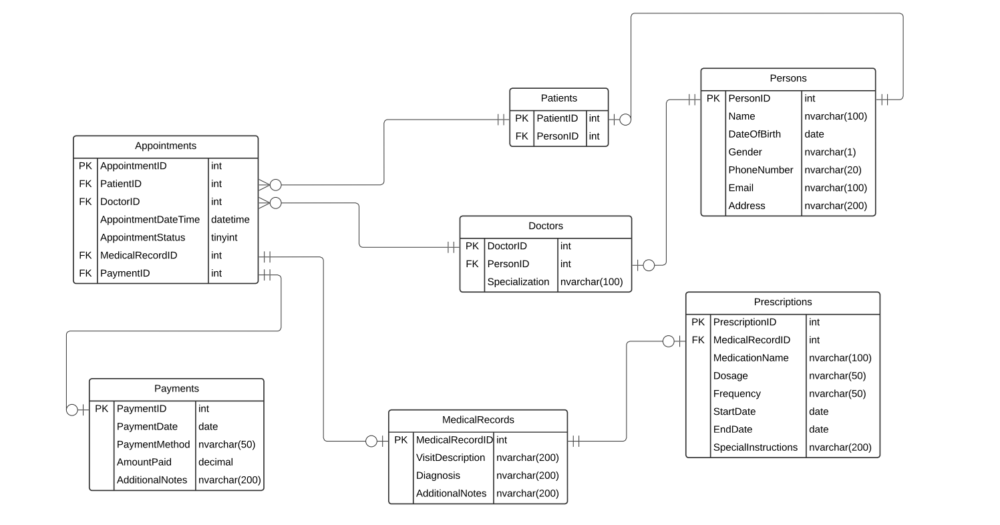

# Database requirements for a simple Clinic

## 1. Patients

- The database should store information about patients. 
- Each patient should have a unique identifier, a name, a
date of birth, gender, contact information (phone number,
email), and address. 

## 2. Doctors

- The database should store information about doctors. 
- Each doctor should have a unique identifier, a name,
specialization, a date of birth, gender, contact
information (phone number, email), and address. 

## 3. Appointments

- The database should store information about appointments. 
- Each appointment should have a unique identifier, a
patient, a doctor, appointment date and time, and
appointment status. 
- Appointment Status: 
    1. **Pending**    : The appointment has been scheduled but has not
                       yet occurred. 
    2. **Confirmed**  : The appointment has been confirmed by both
                      the patient and the healthcare provider. 
    3. **Completed**  : The appointment has taken place as scheduled.
    4. **Canceled**   :  The appointment has been canceled either by
                        the patient or the healthcare provider. 
    5. **Rescheduled**: The appointment has been rescheduled for a
                        different date or time. 
    6.  **No Show**   : The patient did not show up for the appointment
                        without canceling or rescheduling. 

## 4. Medical Records:

- The database should store medical records for patients. 
- For each attended appointment there should be a medical
record.
- Each medical record should have a unique identifier, a
patient, a doctor, a description of the visit, diagnosis,
prescribed medication, and any additional notes. 

## 5. Prescriptions : 
    
- The database should store information about prescribed medications 
- For each medical record there should be at most one
prescription.
- Each prescription should have a unique identifier, a
medical record, medication name, dosage, frequency, start
date, end date, and any special instructions. 

## 6. Payments : 

- The database should store information about payments. 
-  Payment is per appointment. 
- Each payment should have a unique identifier, a patient, a
payment date, payment method, amount paid, and any additional
notes. 

