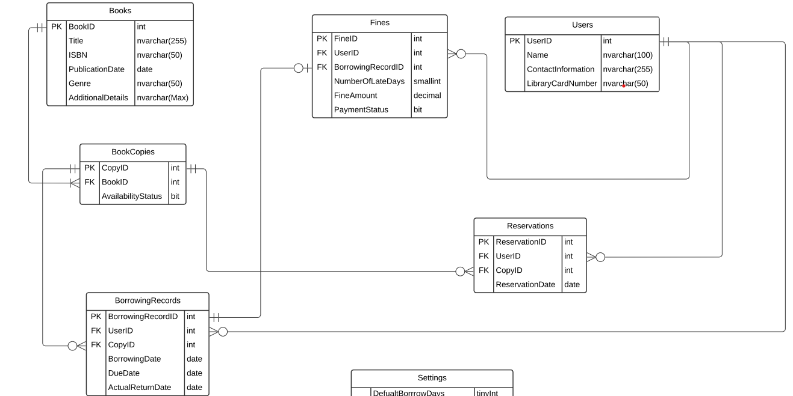

# Database requirements for a Library

## 1. Book Management:

- Store and manage information about books, including title,
author(s), ISBN, publication date, genre, and additional
details. 
-  Track availability status of book copies, indicating
whether they are available for borrowing or checked out by
users. 
- Manage multiple copies of a book, each with a unique
identifier (copy ID). 

## 2. User Management

- Maintain records of library users, including their
names, contact information, and library card numbers. 

## 3. Borrowing and Returns:

- Enable users to borrow book copies from the library. 
- Track borrowing records, including the book copy
borrowed, user information, borrowing date, and due
date.
- Handle the return process, updating the availability
status of book copies.
- Check for any fines or penalties associated with late
returns or damaged book copies. 

## 4. Holds and Reservations: 

- Allow users to place holds or reservations on book
copies that are currently checked out. 
- Manage the order of reservations to ensure fairness. 

## 5. Fine Management: : 
    
- Calculate and manage fines or penalties for late
returns book copies. 
-  Keep track of the fine amount owed by each user. 
- Maintain the payment status to track whether fines
have been paid or are still pending. 

