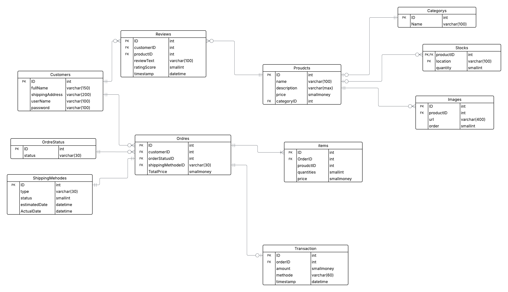

# Database requirements for online Store  :

## 1. Product Catalog Management:

- This would store information about the products available
for sale. It would include attributes such as product
name, description, price, quantity in stock, images, and
other relevant details. 

## 2. Customer Information:

- This would store information about registered customers.
- It would include data such as customer name, contact
details, shipping address, login credentials.
## 3. Order Information:

- This would store information about customer orders. It
would include data such as order number, customer details,
order date and time, purchased products, quantities,
prices, shipping method, and order status.
- Order Status: Pending, Processing, Shipped, Delivered,
Cancelled, Refunded. 

## 4.  Payment Transaction: 

- This would store information about payment transactions.
- It would include data such as transaction ID, customer
details, payment amount, payment method, timestamp. 

## 5. Shipping :

- This would store information about shipping and logistics.
- It would include data such as order ID, shipping carrier
details, tracking number, shipping status, Estimated
delivery date, Actual Delivery Date and any related notes
or updates.
- Shipping Status:
    1. **Processing**
    2. **Out for Delivery**
    3. **Delivered**
    4. **Return to Sender**
    5. **On Hold**
    6. **Delayed**
    7. **Lost**

## 6. Reviews and Ratings:

- This would store customer reviews and ratings for
products. It would include data such as product ID,
customer ID, review text, rating score (1 to 5), and
timestamps. 

